# Dependency Graph and Gantt Chart — Quantum Learning Website MVP

## Overview

This document contains two Mermaid diagrams for the full MVP build:

1. **Dependency Graph** — every task node and its direct prerequisites (no transitive edges).
2. **Gantt Chart** — a sequential schedule for a solo developer working 20 hours/week.

Conventions:
- Each lesson X is split into three nodes: `X_SPEC`, `X_PROSE`, `X_VIS`.
- A "day" = 4 hours of focused work (20 hrs / 5 working days).
- Edges are minimal: if A depends on B depends on C, the edge A->C is omitted.

---

## 0. Progress Tracker

Update the status column when a task is completed. Statuses: `todo`, `in-progress`, `done`.

### Infrastructure

| Node | Description | Est. Days | Status |
|------|-------------|-----------|--------|
| INFRA_NEXTJS | Next.js + Tailwind + MDX | 3 | todo |
| INFRA_DB | DB schema & migrations | 2 | todo |
| INFRA_AUTH | Authentication | 2 | todo |
| INFRA_PAYMENTS | Stripe integration | 3 | todo |
| INFRA_CI | CI/CD pipeline | 1 | todo |
| FRONTEND_SHELL | Layout, nav, lesson template | 3 | todo |

### Simulators

| Node | Description | Est. Days | Status |
|------|-------------|-----------|--------|
| SIM_CORE | Linear-algebra core | 5 | todo |
| SIM_QUBIT_UI | Qubit circuit simulator | 5 | todo |
| SIM_SG_UI | Stern-Gerlach simulator | 3 | todo |
| SIM_CHSH_UI | CHSH inequality simulator | 3 | todo |
| SIM_SCHRODINGER_UI | 1D Schrodinger simulator | 4 | todo |

### Track A — Mathematics

| Node | Description | Est. Days | Status |
|------|-------------|-----------|--------|
| A1_SPEC | Complex numbers spec | 0.5 | todo |
| A1_PROSE | Complex numbers prose | 1 | todo |
| A1_VIS | Complex numbers visuals | 0.5 | todo |
| A2_SPEC | Vectors spec | 0.5 | todo |
| A2_PROSE | Vectors prose | 1 | todo |
| A2_VIS | Vectors visuals | 0.5 | todo |
| A3_SPEC | Matrices spec | 0.5 | todo |
| A3_PROSE | Matrices prose | 2 | todo |
| A3_VIS | Matrices visuals | 0.5 | todo |
| A4_SPEC | Eigenvalues spec | 0.5 | todo |
| A4_PROSE | Eigenvalues prose | 2 | todo |
| A4_VIS | Eigenvalues visuals | 0.5 | todo |
| A5_SPEC | Tensor products spec | 0.5 | todo |
| A5_PROSE | Tensor products prose | 2 | todo |
| A5_VIS | Tensor products visuals | 0.5 | todo |
| A6_SPEC | Probability / Born rule spec | 0.5 | todo |
| A6_PROSE | Probability / Born rule prose | 2 | todo |
| A6_VIS | Probability / Born rule visuals | 0.5 | todo |

### Track P — Physics

| Node | Description | Est. Days | Status |
|------|-------------|-----------|--------|
| P1_SPEC | Classical physics fails spec | 0.5 | todo |
| P1_PROSE | Classical physics fails prose | 2 | todo |
| P1_VIS | Classical physics fails visuals | 1 | todo |
| P2_SPEC | Postulates spec | 0.5 | todo |
| P2_PROSE | Postulates prose | 2 | todo |
| P2_VIS | Postulates visuals | 1 | todo |
| P3_SPEC | Schrodinger equation spec | 1 | todo |
| P3_PROSE | Schrodinger equation prose | 3 | todo |
| P3_VIS | Schrodinger equation visuals | 2 | todo |
| P4_SPEC | Spin / Pauli spec | 0.5 | todo |
| P4_PROSE | Spin / Pauli prose | 2 | todo |
| P4_VIS | Spin / Pauli visuals | 2 | todo |
| P5_SPEC | Uncertainty spec | 0.5 | todo |
| P5_PROSE | Uncertainty prose | 2 | todo |
| P5_VIS | Uncertainty visuals | 1 | todo |
| P6_SPEC | Bell / CHSH spec | 1 | todo |
| P6_PROSE | Bell / CHSH prose | 3 | todo |
| P6_VIS | Bell / CHSH visuals | 2 | todo |
| P7_SPEC | Decoherence spec | 0.5 | todo |
| P7_PROSE | Decoherence prose | 2 | todo |
| P7_VIS | Decoherence visuals | 1 | todo |

### Track C — Computing

| Node | Description | Est. Days | Status |
|------|-------------|-----------|--------|
| C1_SPEC | Qubit spec | 0.5 | todo |
| C1_PROSE | Qubit prose | 1 | todo |
| C1_VIS | Qubit visuals | 1 | todo |
| C2_SPEC | Measurement spec | 0.5 | todo |
| C2_PROSE | Measurement prose | 1 | todo |
| C2_VIS | Measurement visuals | 1 | todo |
| C3_SPEC | Gates / Bloch sphere spec | 0.5 | todo |
| C3_PROSE | Gates / Bloch sphere prose | 2 | todo |
| C3_VIS | Gates / Bloch sphere visuals | 2 | todo |
| C4_SPEC | Multi-qubit spec | 0.5 | todo |
| C4_PROSE | Multi-qubit prose | 2 | todo |
| C4_VIS | Multi-qubit visuals | 2 | todo |
| C5_SPEC | Universal gates spec | 0.5 | todo |
| C5_PROSE | Universal gates prose | 2 | todo |
| C5_VIS | Universal gates visuals | 1 | todo |
| C6_SPEC | Deutsch-Jozsa spec | 0.5 | todo |
| C6_PROSE | Deutsch-Jozsa prose | 2 | todo |
| C6_VIS | Deutsch-Jozsa visuals | 1 | todo |
| C7_SPEC | Teleportation spec | 0.5 | todo |
| C7_PROSE | Teleportation prose | 2 | todo |
| C7_VIS | Teleportation visuals | 1 | todo |
| C8_SPEC | Grover spec | 1 | todo |
| C8_PROSE | Grover prose | 3 | todo |
| C8_VIS | Grover visuals | 2 | todo |
| C9_SPEC | QFT spec | 0.5 | todo |
| C9_PROSE | QFT prose | 3 | todo |
| C9_VIS | QFT visuals | 1 | todo |
| C10_SPEC | Shor spec | 1 | todo |
| C10_PROSE | Shor prose | 3 | todo |
| C10_VIS | Shor visuals | 2 | todo |

### Launch

| Node | Description | Est. Days | Status |
|------|-------------|-----------|--------|
| POLISH | Testing, bug fixes, copyediting | 5 | todo |

---

## 1. Dependency Graph

The graph uses `graph TD` (top-down) for readability given the depth of the content chains. Subgraphs group nodes by category: Infrastructure, Simulators, Track A (Math), Track P (Physics), and Track C (Computing). Within each track subgraph, SPEC/PROSE/VIS nodes are present.

**Reading the graph:**
- Infrastructure and simulator nodes form the "platform spine."
- SPEC nodes depend only on other SPEC nodes (content ordering).
- PROSE nodes depend on their own SPEC, on prerequisite PROSE nodes, and on FRONTEND_SHELL.
- VIS nodes depend on their own PROSE and on the simulator UI(s) they need (if any).
- Parallelism is explicit: nodes with no path between them can be worked on in any order.

```mermaid
graph TD

  %% =========================================
  %% INFRASTRUCTURE
  %% =========================================
  subgraph INFRA["Infrastructure"]
    INFRA_NEXTJS["INFRA_NEXTJS<br/>Next.js + Tailwind + MDX"]
    INFRA_DB["INFRA_DB<br/>DB schema & migrations"]
    INFRA_AUTH["INFRA_AUTH<br/>Authentication"]
    INFRA_PAYMENTS["INFRA_PAYMENTS<br/>Stripe integration"]
    INFRA_CI["INFRA_CI<br/>CI/CD pipeline"]
    FRONTEND_SHELL["FRONTEND_SHELL<br/>Layout, nav, lesson template"]

    INFRA_NEXTJS --> INFRA_DB
    INFRA_DB --> INFRA_AUTH
    INFRA_AUTH --> INFRA_PAYMENTS
    INFRA_NEXTJS --> INFRA_CI
    INFRA_NEXTJS --> FRONTEND_SHELL
  end

  %% =========================================
  %% SIMULATORS
  %% =========================================
  subgraph SIM["Simulators"]
    SIM_CORE["SIM_CORE<br/>Linear-algebra core"]
    SIM_QUBIT_UI["SIM_QUBIT_UI<br/>Qubit circuit simulator"]
    SIM_SG_UI["SIM_SG_UI<br/>Stern-Gerlach simulator"]
    SIM_CHSH_UI["SIM_CHSH_UI<br/>CHSH inequality simulator"]
    SIM_SCHRODINGER_UI["SIM_SCHRODINGER_UI<br/>1D Schrodinger simulator"]

    SIM_CORE --> SIM_QUBIT_UI
    SIM_CORE --> SIM_SG_UI
    SIM_CORE --> SIM_CHSH_UI
    SIM_CORE --> SIM_SCHRODINGER_UI
  end

  %% =========================================
  %% TRACK A — MATH (SPEC)
  %% =========================================
  subgraph TRACK_A["Track A — Mathematics"]

    subgraph TRACK_A_SPEC["Specs"]
      A1_SPEC["A1_SPEC<br/>Complex numbers"]
      A2_SPEC["A2_SPEC<br/>Vectors"]
      A3_SPEC["A3_SPEC<br/>Matrices"]
      A4_SPEC["A4_SPEC<br/>Eigenvalues"]
      A5_SPEC["A5_SPEC<br/>Tensor products"]
      A6_SPEC["A6_SPEC<br/>Probability / Born rule"]

      A1_SPEC --> A2_SPEC
      A2_SPEC --> A3_SPEC
      A3_SPEC --> A4_SPEC
      A3_SPEC --> A5_SPEC
      A4_SPEC --> A6_SPEC
    end

    subgraph TRACK_A_PROSE["Prose"]
      A1_PROSE["A1_PROSE"]
      A2_PROSE["A2_PROSE"]
      A3_PROSE["A3_PROSE"]
      A4_PROSE["A4_PROSE"]
      A5_PROSE["A5_PROSE"]
      A6_PROSE["A6_PROSE"]
    end

    subgraph TRACK_A_VIS["Visuals"]
      A1_VIS["A1_VIS"]
      A2_VIS["A2_VIS"]
      A3_VIS["A3_VIS"]
      A4_VIS["A4_VIS"]
      A5_VIS["A5_VIS"]
      A6_VIS["A6_VIS"]
    end

    %% SPEC --> PROSE (own)
    A1_SPEC --> A1_PROSE
    A2_SPEC --> A2_PROSE
    A3_SPEC --> A3_PROSE
    A4_SPEC --> A4_PROSE
    A5_SPEC --> A5_PROSE
    A6_SPEC --> A6_PROSE

    %% PROSE prerequisite chains (direct only)
    A1_PROSE --> A2_PROSE
    A2_PROSE --> A3_PROSE
    A3_PROSE --> A4_PROSE
    A3_PROSE --> A5_PROSE
    A4_PROSE --> A6_PROSE

    %% PROSE --> VIS (own)
    A1_PROSE --> A1_VIS
    A2_PROSE --> A2_VIS
    A3_PROSE --> A3_VIS
    A4_PROSE --> A4_VIS
    A5_PROSE --> A5_VIS
    A6_PROSE --> A6_VIS
  end

  %% =========================================
  %% TRACK P — PHYSICS (SPEC)
  %% =========================================
  subgraph TRACK_P["Track P — Physics"]

    subgraph TRACK_P_SPEC["Specs"]
      P1_SPEC["P1_SPEC<br/>Classical physics fails"]
      P2_SPEC["P2_SPEC<br/>Postulates"]
      P3_SPEC["P3_SPEC<br/>Schrodinger equation"]
      P4_SPEC["P4_SPEC<br/>Spin / Pauli"]
      P5_SPEC["P5_SPEC<br/>Uncertainty"]
      P6_SPEC["P6_SPEC<br/>Bell / CHSH"]
      P7_SPEC["P7_SPEC<br/>Decoherence"]
    end

    subgraph TRACK_P_PROSE["Prose"]
      P1_PROSE["P1_PROSE"]
      P2_PROSE["P2_PROSE"]
      P3_PROSE["P3_PROSE"]
      P4_PROSE["P4_PROSE"]
      P5_PROSE["P5_PROSE"]
      P6_PROSE["P6_PROSE"]
      P7_PROSE["P7_PROSE"]
    end

    subgraph TRACK_P_VIS["Visuals"]
      P1_VIS["P1_VIS"]
      P2_VIS["P2_VIS"]
      P3_VIS["P3_VIS"]
      P4_VIS["P4_VIS"]
      P5_VIS["P5_VIS"]
      P6_VIS["P6_VIS"]
      P7_VIS["P7_VIS"]
    end

    %% SPEC dependencies (content order, direct only, no transitive edges)
    A3_SPEC --> P1_SPEC
    P1_SPEC --> P2_SPEC
    P2_SPEC --> P3_SPEC
    A4_SPEC --> P3_SPEC
    P3_SPEC --> P4_SPEC
    A5_SPEC --> P5_SPEC
    P4_SPEC --> P5_SPEC
    A5_SPEC --> P6_SPEC
    P4_SPEC --> P6_SPEC
    P6_SPEC --> P7_SPEC

    %% SPEC --> PROSE (own)
    P1_SPEC --> P1_PROSE
    P2_SPEC --> P2_PROSE
    P3_SPEC --> P3_PROSE
    P4_SPEC --> P4_PROSE
    P5_SPEC --> P5_PROSE
    P6_SPEC --> P6_PROSE
    P7_SPEC --> P7_PROSE

    %% PROSE prerequisite chains (direct only, no transitive edges)
    A3_PROSE --> P1_PROSE
    P1_PROSE --> P2_PROSE
    P2_PROSE --> P3_PROSE
    A4_PROSE --> P3_PROSE
    P3_PROSE --> P4_PROSE
    A5_PROSE --> P5_PROSE
    P4_PROSE --> P5_PROSE
    A5_PROSE --> P6_PROSE
    P4_PROSE --> P6_PROSE
    P6_PROSE --> P7_PROSE

    %% PROSE --> VIS (own)
    P1_PROSE --> P1_VIS
    P2_PROSE --> P2_VIS
    P3_PROSE --> P3_VIS
    P4_PROSE --> P4_VIS
    P5_PROSE --> P5_VIS
    P6_PROSE --> P6_VIS
    P7_PROSE --> P7_VIS
  end

  %% =========================================
  %% TRACK C — COMPUTING (SPEC)
  %% =========================================
  subgraph TRACK_C["Track C — Computing"]

    subgraph TRACK_C_SPEC["Specs"]
      C1_SPEC["C1_SPEC<br/>Qubit"]
      C2_SPEC["C2_SPEC<br/>Measurement"]
      C3_SPEC["C3_SPEC<br/>Gates / Bloch sphere"]
      C4_SPEC["C4_SPEC<br/>Multi-qubit"]
      C5_SPEC["C5_SPEC<br/>Universal gates"]
      C6_SPEC["C6_SPEC<br/>Deutsch-Jozsa"]
      C7_SPEC["C7_SPEC<br/>Teleportation"]
      C8_SPEC["C8_SPEC<br/>Grover"]
      C9_SPEC["C9_SPEC<br/>QFT"]
      C10_SPEC["C10_SPEC<br/>Shor"]
    end

    subgraph TRACK_C_PROSE["Prose"]
      C1_PROSE["C1_PROSE"]
      C2_PROSE["C2_PROSE"]
      C3_PROSE["C3_PROSE"]
      C4_PROSE["C4_PROSE"]
      C5_PROSE["C5_PROSE"]
      C6_PROSE["C6_PROSE"]
      C7_PROSE["C7_PROSE"]
      C8_PROSE["C8_PROSE"]
      C9_PROSE["C9_PROSE"]
      C10_PROSE["C10_PROSE"]
    end

    subgraph TRACK_C_VIS["Visuals"]
      C1_VIS["C1_VIS"]
      C2_VIS["C2_VIS"]
      C3_VIS["C3_VIS"]
      C4_VIS["C4_VIS"]
      C5_VIS["C5_VIS"]
      C6_VIS["C6_VIS"]
      C7_VIS["C7_VIS"]
      C8_VIS["C8_VIS"]
      C9_VIS["C9_VIS"]
      C10_VIS["C10_VIS"]
    end

    %% SPEC dependencies (content order, direct only, no transitive edges)
    P2_SPEC --> C1_SPEC
    A2_SPEC --> C1_SPEC
    C1_SPEC --> C2_SPEC
    P4_SPEC --> C3_SPEC
    C2_SPEC --> C3_SPEC
    P6_SPEC --> C4_SPEC
    C3_SPEC --> C4_SPEC
    C4_SPEC --> C5_SPEC
    A6_SPEC --> C5_SPEC
    C5_SPEC --> C6_SPEC
    C5_SPEC --> C7_SPEC
    C5_SPEC --> C8_SPEC
    C5_SPEC --> C9_SPEC
    C9_SPEC --> C10_SPEC

    %% SPEC --> PROSE (own)
    C1_SPEC --> C1_PROSE
    C2_SPEC --> C2_PROSE
    C3_SPEC --> C3_PROSE
    C4_SPEC --> C4_PROSE
    C5_SPEC --> C5_PROSE
    C6_SPEC --> C6_PROSE
    C7_SPEC --> C7_PROSE
    C8_SPEC --> C8_PROSE
    C9_SPEC --> C9_PROSE
    C10_SPEC --> C10_PROSE

    %% PROSE prerequisite chains (direct only, no transitive edges)
    P2_PROSE --> C1_PROSE
    A2_PROSE --> C1_PROSE
    C1_PROSE --> C2_PROSE
    P4_PROSE --> C3_PROSE
    C2_PROSE --> C3_PROSE
    P6_PROSE --> C4_PROSE
    C3_PROSE --> C4_PROSE
    C4_PROSE --> C5_PROSE
    A6_PROSE --> C5_PROSE
    C5_PROSE --> C6_PROSE
    C5_PROSE --> C7_PROSE
    C5_PROSE --> C8_PROSE
    C5_PROSE --> C9_PROSE
    C9_PROSE --> C10_PROSE

    %% PROSE --> VIS (own)
    C1_PROSE --> C1_VIS
    C2_PROSE --> C2_VIS
    C3_PROSE --> C3_VIS
    C4_PROSE --> C4_VIS
    C5_PROSE --> C5_VIS
    C6_PROSE --> C6_VIS
    C7_PROSE --> C7_VIS
    C8_PROSE --> C8_VIS
    C9_PROSE --> C9_VIS
    C10_PROSE --> C10_VIS
  end

  %% =========================================
  %% CROSS-SUBGRAPH: FRONTEND_SHELL --> PROSE
  %% Only A1_PROSE needs a direct edge; all other PROSE nodes
  %% are transitively reachable from A1_PROSE via prerequisite chains.
  %% =========================================
  FRONTEND_SHELL --> A1_PROSE

  %% =========================================
  %% CROSS-SUBGRAPH: Simulator UI --> VIS nodes
  %% =========================================
  %% Qubit simulator: C1, C2, C3, C4, C5, C6, C7, C8, C9, C10, P2, P7
  SIM_QUBIT_UI --> C1_VIS
  SIM_QUBIT_UI --> C2_VIS
  SIM_QUBIT_UI --> C3_VIS
  SIM_QUBIT_UI --> C4_VIS
  SIM_QUBIT_UI --> C5_VIS
  SIM_QUBIT_UI --> C6_VIS
  SIM_QUBIT_UI --> C7_VIS
  SIM_QUBIT_UI --> C8_VIS
  SIM_QUBIT_UI --> C9_VIS
  SIM_QUBIT_UI --> C10_VIS
  SIM_QUBIT_UI --> P2_VIS
  SIM_QUBIT_UI --> P7_VIS

  %% Stern-Gerlach simulator: P1, P4, P5
  SIM_SG_UI --> P1_VIS
  SIM_SG_UI --> P4_VIS
  SIM_SG_UI --> P5_VIS

  %% CHSH simulator: P6
  SIM_CHSH_UI --> P6_VIS

  %% Schrodinger simulator: P3, P5
  SIM_SCHRODINGER_UI --> P3_VIS
  SIM_SCHRODINGER_UI --> P5_VIS
```

**Node count:** 69 content nodes + 5 simulator nodes + 6 infrastructure nodes = **80 nodes total**.

**Key structural observations:**
- The longest SPEC chain runs: A1 -> A2 -> A3 -> A4 -> A6 (5 hops in math), or A1 -> A2 -> A3 -> P1 -> P2 -> C1 -> C2 -> C3 -> C4 -> C5 -> C6/C7/C8/C9 -> C10 (up to 12 hops crossing tracks).
- PROSE chains mirror SPEC chains but also gate on FRONTEND_SHELL.
- VIS nodes are the terminal layer and gate on simulator UIs, which are independent of content.
- Infrastructure and simulators can be built in parallel with content specs.

---

## 2. Gantt Chart

### Critical Path Analysis

The critical path is the longest chain of dependent tasks that determines the minimum project duration. To identify it, we need to trace through the dependency graph and sum durations.

**Tracing the critical path (longest chain of dependent work):**

The infrastructure chain to unblock PROSE is:
> INFRA_NEXTJS (3d) -> INFRA_CI (1d) -> INFRA_DB (2d) -> FRONTEND_SHELL (3d) = **9 days**

The deepest PROSE chain starting from A1_PROSE:

First attempt -- naive path through P1/P2/C2:
> A1_PROSE (1d) -> A2_PROSE (1d) -> A3_PROSE (2d) -> P1 (2d) -> P2 (2d) -> C2 (1d) -> C3 (2d) -> C4 (2d) -> C5 (2d) -> C9 (3d) -> C10 (3d) = 21 days

But C3_PROSE also depends on P4_PROSE (via the P4 -> C3 edge). The path into C3 via P4 is:
> A3_PROSE (2d) -> A4_PROSE (2d) -> P3_PROSE (3d) -> P4_PROSE (2d) -> C3_PROSE = 9d from end of A2

...versus the P2 -> C2 path:
> A3_PROSE (2d) -> P1 (2d) -> P2 (2d) -> C2 (1d) -> C3_PROSE = 7d from end of A2

The P4 path is 2 days longer. And C4_PROSE depends on P6_PROSE:
> P4_PROSE (2d) -> P6_PROSE (3d) -> C4_PROSE = 5d from end of P3

...versus the C3 path:
> P4_PROSE (2d) -> C3_PROSE (2d) -> C4_PROSE = 4d from end of P3

The P6 path is 1 day longer.

C5_PROSE depends on A6_PROSE. A6 depends on A4 (2d) -> A6 (2d) = 4d after A3. But the path through P3/P4/P6 already consumes 3+2+3 = 8d after A4, so A6 is not on the critical path.

**Final critical path:**
> INFRA_NEXTJS (3d) -> INFRA_CI (1d) -> INFRA_DB (2d) -> FRONTEND_SHELL (3d) -> A1_PROSE (1d) -> A2_PROSE (1d) -> A3_PROSE (2d) -> A4_PROSE (2d) -> P3_PROSE (3d) -> P4_PROSE (2d) -> P6_PROSE (3d) -> C4_PROSE (2d) -> C5_PROSE (2d) -> C9_PROSE (3d) -> C10_PROSE (3d) -> C10_VIS (2d) -> Polish (5d)

C10_VIS also needs SIM_QUBIT_UI (which needs SIM_CORE). Total simulator path: SIM_CORE (5d) + SIM_QUBIT_UI (5d) = 10 days. Since C10_VIS doesn't start until day 9+24 = 33 at the earliest, the simulator (done by day 10) is not on the critical path.

SPEC nodes gate PROSE, but SPECs run much faster than PROSE (0.5-1d each vs 1-3d). The full SPEC chain is at most ~12 days. By the time A1_PROSE starts (day 9 at earliest), all specs for lessons A1-A4 are easily complete. SPECs never appear on the critical path.

**Critical path total: 9 + 1 + 1 + 2 + 2 + 3 + 2 + 3 + 2 + 2 + 3 + 3 + 2 + 5 = 40 working days (8 weeks).**

This is the theoretical minimum with unlimited parallel workers. For a solo developer, the binding constraint is the sum of all work (~127 days), not the critical path.

### Exact Task Duration Inventory

**Infrastructure (14 days):**
| Task | Days |
|------|------|
| INFRA_NEXTJS | 3 |
| INFRA_DB | 2 |
| INFRA_AUTH | 2 |
| INFRA_PAYMENTS | 3 |
| INFRA_CI | 1 |
| FRONTEND_SHELL | 3 |

**Simulators (20 days):**
| Task | Days |
|------|------|
| SIM_CORE | 5 |
| SIM_QUBIT_UI | 5 |
| SIM_SG_UI | 3 |
| SIM_CHSH_UI | 3 |
| SIM_SCHRODINGER_UI | 4 |

**Content SPECs (13.5 days):**
Standard (0.5d each): A1, A2, A3, A4, A5, A6, P1, P2, P4, P5, P7, C1, C2, C3, C4, C5, C6, C7, C9 = 19 x 0.5 = 9.5d
Long (1d each): P3, P6, C8, C10 = 4 x 1 = 4d
Total: 13.5 days

**Content PROSE (47 days):**
Simple (1d): A1, A2, C1, C2 = 4d
Medium (2d): A3, A4, A5, A6, P1, P2, P4, P5, P7, C3, C4, C5, C6, C7 = 28d
Long (3d): P3, P6, C8, C9, C10 = 15d
Total: 47 days

**Content VISUALS (27 days):**
No simulator (0.5d): A1, A2, A3, A4, A5, A6 = 3d
Basic simulator (1d): C1, C2, C5, C6, C7, C9, P1, P2, P5, P7 = 10d
Heavy simulator (2d): P3, P4, P6, C3, C4, C8, C10 = 14d
Total: 27 days

**Polish: 5 days**

**Grand total: 14 + 20 + 13.5 + 47 + 27 + 5 = 126.5 days = 25.3 weeks at 20 hrs/week.**

### Scheduling Strategy

The Gantt below schedules tasks to respect all dependencies while keeping the developer continuously occupied. The strategy is:

1. **Infrastructure first** (NEXTJS, then DB/CI/SHELL) to unblock content prose as early as possible.
2. **Specs start immediately after core infrastructure**, since they have no simulator or database dependency.
3. **SIM_CORE runs after the first wave of specs** to unblock simulator UIs later.
4. **Prose follows the critical content path** -- math foundations, then physics, then computing.
5. **Simulator UIs are built mid-project** after SIM_CORE and the first round of prose, well before visuals need them.
6. **Auth and Payments are deferred** to late in the schedule since they gate nothing except monetization.
7. **Visuals come last**, once all prose and all simulator UIs are complete.

Note on resolution: Mermaid gantt has a minimum resolution of 1 day. SPEC tasks estimated at 0.5 days are rendered as 1 day; this adds ~10 days of display padding versus the raw hour estimate. The "true" total at half-day precision is ~127 working days; the Gantt displays ~137 days due to rounding.

```mermaid
gantt
  title Quantum Learning Website MVP — Solo Developer (20 hrs/week)
  dateFormat YYYY-MM-DD
  axisFormat %b %d
  excludes weekends

  section Infrastructure — Core
    INFRA_NEXTJS                :infra_nj,   2026-04-13, 3d
    INFRA_CI                    :infra_ci,   after infra_nj, 1d
    INFRA_DB                    :infra_db,   after infra_ci, 2d
    FRONTEND_SHELL              :fe_shell,   after infra_db, 3d

  section Content Specs — Wave 1
    A1_SPEC                     :a1s,  after fe_shell, 1d
    A2_SPEC                     :a2s,  after a1s, 1d
    A3_SPEC                     :a3s,  after a2s, 1d
    A4_SPEC                     :a4s,  after a3s, 1d
    A5_SPEC                     :a5s,  after a4s, 1d
    P1_SPEC                     :p1s,  after a5s, 1d
    P2_SPEC                     :p2s,  after p1s, 1d

  section Simulator Core
    SIM_CORE                    :sim_core, after p2s, 5d

  section Content Specs — Wave 2
    P3_SPEC                     :p3s,  after sim_core, 1d
    P4_SPEC                     :p4s,  after p3s, 1d
    P5_SPEC                     :p5s,  after p4s, 1d
    P6_SPEC                     :p6s,  after p5s, 1d
    P7_SPEC                     :p7s,  after p6s, 1d
    A6_SPEC                     :a6s,  after p7s, 1d
    C1_SPEC                     :c1s,  after a6s, 1d
    C2_SPEC                     :c2s,  after c1s, 1d
    C3_SPEC                     :c3s,  after c2s, 1d
    C4_SPEC                     :c4s,  after c3s, 1d
    C5_SPEC                     :c5s,  after c4s, 1d
    C6_SPEC                     :c6s,  after c5s, 1d
    C7_SPEC                     :c7s,  after c6s, 1d
    C8_SPEC                     :c8s,  after c7s, 1d
    C9_SPEC                     :c9s,  after c8s, 1d
    C10_SPEC                    :c10s, after c9s, 1d

  section Content Prose — Math Foundations
    A1_PROSE                    :a1p,  after c10s, 1d
    A2_PROSE                    :a2p,  after a1p, 1d
    A3_PROSE                    :a3p,  after a2p, 2d
    A4_PROSE                    :a4p,  after a3p, 2d
    A5_PROSE                    :a5p,  after a4p, 2d
    P1_PROSE                    :p1p,  after a5p, 2d
    P2_PROSE                    :p2p,  after p1p, 2d
    P3_PROSE                    :p3p,  after p2p, 3d
    P4_PROSE                    :p4p,  after p3p, 2d

  section Simulator UIs
    SIM_SG_UI                   :sim_sg,   after p4p, 3d
    SIM_SCHRODINGER_UI          :sim_sc,   after sim_sg, 4d
    SIM_QUBIT_UI                :sim_qb,   after sim_sc, 5d
    SIM_CHSH_UI                 :sim_ch,   after sim_qb, 3d

  section Content Prose — Physics and Computing
    P5_PROSE                    :p5p,  after sim_ch, 2d
    P6_PROSE                    :p6p,  after p5p, 3d
    A6_PROSE                    :a6p,  after p6p, 2d
    C1_PROSE                    :c1p,  after a6p, 1d
    C2_PROSE                    :c2p,  after c1p, 1d
    C3_PROSE                    :c3p,  after c2p, 2d
    C4_PROSE                    :c4p,  after c3p, 2d
    C5_PROSE                    :c5p,  after c4p, 2d
    C6_PROSE                    :c6p,  after c5p, 2d
    C7_PROSE                    :c7p,  after c6p, 2d
    P7_PROSE                    :p7p,  after c7p, 2d
    C8_PROSE                    :c8p,  after p7p, 3d
    C9_PROSE                    :c9p,  after c8p, 3d
    C10_PROSE                   :c10p, after c9p, 3d

  section Content Visuals — No Simulator
    A1_VIS                      :a1v,  after c10p, 1d
    A2_VIS                      :a2v,  after a1v, 1d
    A3_VIS                      :a3v,  after a2v, 1d
    A4_VIS                      :a4v,  after a3v, 1d
    A5_VIS                      :a5v,  after a4v, 1d
    A6_VIS                      :a6v,  after a5v, 1d

  section Content Visuals — With Simulators
    P1_VIS                      :p1v,  after a6v, 1d
    P2_VIS                      :p2v,  after p1v, 1d
    P3_VIS                      :p3v,  after p2v, 2d
    P4_VIS                      :p4v,  after p3v, 2d
    P5_VIS                      :p5v,  after p4v, 1d
    P6_VIS                      :p6v,  after p5v, 2d
    P7_VIS                      :p7v,  after p6v, 1d
    C1_VIS                      :c1v,  after p7v, 1d
    C2_VIS                      :c2v,  after c1v, 1d
    C3_VIS                      :c3v,  after c2v, 2d
    C4_VIS                      :c4v,  after c3v, 2d
    C5_VIS                      :c5v,  after c4v, 1d
    C6_VIS                      :c6v,  after c5v, 1d
    C7_VIS                      :c7v,  after c6v, 1d
    C8_VIS                      :c8v,  after c7v, 2d
    C9_VIS                      :c9v,  after c8v, 1d
    C10_VIS                     :c10v, after c9v, 2d

  section Payments
    INFRA_AUTH                  :infra_auth, after c10v, 2d
    INFRA_PAYMENTS              :infra_pay,  after infra_auth, 3d

  section Polish and Launch
    Polish and Launch           :polish, after infra_pay, 5d
```

> **Note on the Gantt schedule:** This is a strict linearization for a solo developer working one task at a time. All dependency constraints are satisfied: no task begins before every one of its prerequisites is complete. Where the graph allows parallel tasks, they are freely reordered to fill the schedule efficiently. The simulator UIs are built mid-project (between early prose and late prose) so they are ready well before visuals need them. Auth and Payments are deferred to near the end since they gate nothing except monetization.

---

## 3. Commentary

### Total Estimated Duration

**Raw task-hour inventory:**

| Category | Raw days | Hours |
|----------|----------|-------|
| Infrastructure (NEXTJS + CI + DB + SHELL) | 9 | 36 |
| Auth + Payments | 5 | 20 |
| Simulator core | 5 | 20 |
| Simulator UIs (4 components) | 15 | 60 |
| Content specs (23 lessons) | 13.5 | 54 |
| Content prose (23 lessons) | 47 | 188 |
| Content visuals (23 lessons) | 27 | 108 |
| Polish & launch | 5 | 20 |
| **Total** | **126.5** | **506** |

At 20 hours/week (5 working days of 4 hours each), the raw total is **126.5 working days = 25.3 weeks**.

The Gantt chart, with half-day SPECs rounded to 1 day, shows approximately **137 working days = 27.4 weeks**. The true duration lies between these figures depending on how efficiently half-days are packed.

**Realistic estimate: 26 weeks (6.5 months)**, starting mid-April 2026, finishing late October 2026.

### Week-by-Week Character

| Weeks | Phase | Character |
|-------|-------|-----------|
| 1-2 | Infrastructure (NEXTJS, CI, DB, Shell) | Pure build -- framework, CI, database, MDX pipeline |
| 3-4 | Content Specs Wave 1 + SIM_CORE | Mixed -- outlining early lessons while building LA engine |
| 5-7 | Content Specs Wave 2 | Content-heavy -- outlining remaining 16 lessons |
| 8-11 | Content Prose (math + early physics) | Content-heavy -- writing A1-A5, P1-P4 |
| 12-14 | Simulator UIs | Build-heavy -- 4 interactive components |
| 15-20 | Content Prose (physics + computing) | Content-heavy -- writing P5-P7, C1-C10 |
| 21-25 | Content Visuals (all 23 lessons) | Mixed -- diagrams, problem sets, simulator wiring |
| 25-26 | Auth + Payments | Build -- authentication and Stripe integration |
| 27 | Polish & Launch | Mixed -- testing, bug fixes, copyediting |

### Critical Path

The critical path determines the minimum possible duration regardless of team size. It runs through the deepest content dependency chain:

**INFRA_NEXTJS (3d) -> INFRA_DB (2d) -> FRONTEND_SHELL (3d) -> A1_PROSE (1d) -> A2_PROSE (1d) -> A3_PROSE (2d) -> A4_PROSE (2d) -> P3_PROSE (3d) -> P4_PROSE (2d) -> P6_PROSE (3d) -> C4_PROSE (2d) -> C5_PROSE (2d) -> C9_PROSE (3d) -> C10_PROSE (3d) -> C10_VIS (2d) -> Polish (5d)**

Wait -- FRONTEND_SHELL depends on INFRA_DB which depends on INFRA_NEXTJS (via INFRA_CI). Accounting for this:

> INFRA_NEXTJS (3d) -> INFRA_CI (1d) -> INFRA_DB (2d) -> FRONTEND_SHELL (3d) = 9d of infrastructure

Then the PROSE chain: 1+1+2+2+3+2+3+2+2+3+3 = 24d

Then C10_VIS (2d) + Polish (5d) = 7d

**Critical path total: 9 + 24 + 7 = 40 working days (8 weeks).**

This is the theoretical minimum with unlimited parallel workers. For a solo developer, the binding constraint is simply the sum of all work (~127 days). The critical path becomes relevant only when considering team scaling.

The critical path is driven by the deep cross-track dependency chain: math foundations (A1-A4) feed into physics (P3-P4-P6), which feeds into computing (C4-C5-C9-C10), with Shor's algorithm sitting at the very end of a 12-lesson prerequisite chain.

### Risks and What Could Slip

1. **Content prose is the largest block (47 days, 37% of the project).** If any lesson takes longer than estimated -- particularly the "long" lessons (P3 Schrodinger equation, P6 Bell/CHSH, C8 Grover, C9 QFT, C10 Shor at 3 days each) -- the schedule extends directly. Each involves substantial mathematical exposition and careful pedagogy.

2. **Simulator complexity is uncertain.** The Qubit circuit simulator (5 days) and Schrodinger simulator (4 days) involve non-trivial numerical work. If the linear algebra core needs WebAssembly or GPU acceleration for performance, SIM_CORE could balloon from 5 to 10+ days.

3. **The Shor's algorithm lesson (C10) is the hardest single lesson** -- it requires QFT, modular exponentiation, continued fractions, and the reduction from factoring to period-finding. The 3-day PROSE estimate may be optimistic; 5 days is plausible.

4. **Payments integration (Stripe) is deferred to week 25-26.** If Stripe account approval or API issues arise, this can slip past launch without blocking content. Alternatively, launch as free-tier first, add payments post-launch.

5. **Scope creep in visuals.** Problem sets and interactive visuals tend to expand. The 27-day visual budget assumes disciplined scoping -- one pass per lesson, no custom animations beyond what the simulators provide.

6. **Simulator UIs block the entire visuals phase.** If any simulator UI takes longer than estimated, all 17 simulator-dependent VIS nodes are delayed. This is the most fragile coupling in the schedule.

### Parallelization Opportunities (If a Second Developer Joins)

The optimal split for two developers:

**Developer A (Content-focused):**
- All 23 SPEC nodes (can start day 1 -- no infrastructure dependency)
- All 23 PROSE nodes (needs FRONTEND_SHELL from Dev B, ~9 days in)
- All 23 VIS nodes (needs simulator UIs from Dev B)

**Developer B (Engineering-focused):**
- All infrastructure (INFRA_NEXTJS, DB, AUTH, PAYMENTS, CI, FRONTEND_SHELL)
- All simulators (SIM_CORE + 4 UIs)
- Integration testing and polish

This split works because:
- Content SPECs have zero infrastructure dependencies -- Dev A writes outlines while Dev B builds the platform.
- PROSE only needs FRONTEND_SHELL, which Dev B delivers by day ~9.
- Simulators are fully independent of content until the VIS phase.
- By the time Dev A finishes prose (~week 14 from their start), Dev B has long since finished all simulator UIs (14 + 20 = 34 days of work).

**Estimated time with two developers:**
- Dev B's total work: 14 (infra) + 20 (simulators) + 5 (polish) = 39 days
- Dev A's total work: 13.5 (specs) + 47 (prose) + 27 (visuals) = 87.5 days
- Dev A must wait ~9 days for FRONTEND_SHELL before starting prose, and must wait for simulator UIs before starting simulator-dependent VIS nodes. But Dev B finishes all UIs by ~day 34, well before Dev A reaches VIS (day ~60).
- Binding constraint: Dev A's ~88 days of serial content work, with a 9-day initial wait = **~19 weeks**.
- **Two-developer estimate: ~19 weeks** (down from 26), a 27% reduction.

With three developers, you could further split content writing (one on math + physics tracks, one on computing track), potentially reaching **~14-15 weeks**. The limiting factor becomes the critical-path prose chain (A1 through C10), which has 24 days of strictly sequential dependent work even with unlimited writers.
